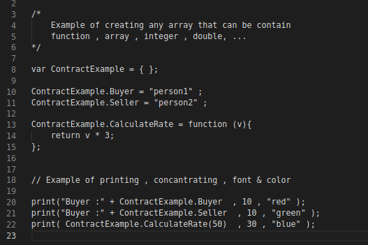

<!-- PROJECT SHIELDS -->
<!--
*** I'm using markdown "reference style" links for readability.
*** Reference links are enclosed in brackets [ ] instead of parentheses ( ).
*** See the bottom of this document for the declaration of the reference variables
*** for contributors-url, forks-url, etc. This is an optional, concise syntax you may use.
*** https://www.markdownguide.org/basic-syntax/#reference-style-links
-->

[![Forks][forks-shield]][forks-url]
[![Stargazers][stars-shield]][stars-url]
[![Issues][issues-shield]][issues-url]


<!-- PROJECT LOGO -->
<br />
<p align="center">
  <a href="github.com/ozguralperen/l-lang">
    
  </a>

  <h3 align="center"> llang </h3>

  <p align="center">
    Revolutionary Programming Language For Law
    <br />
    <a href="github.com/ozguralperen/l-lang/tree/main/AnotherInformations"><strong>Syntax Documentation »</strong></a>
    <br />
    <br />
    <a href="https://github.com/ozguralperen/l-lang/main/Build">Download</a>
    ·
    <a href="https://github.com/ozguralperen/l-lang/issues">Report Bug</a>
    ·
    <a href="https://github.com/ozguralperen/l-lang/issues">Request Feature</a>
  </p>
</p>


<!-- TABLE OF CONTENTS -->
<details open="open">
  <summary><h2 style="display: inline-block">Table of Contents</h2></summary>
  <ol>
    <li>
      <a href="# ">What is the L-lang ?</a>
      <ul>
        <li><a href="#">What kind of revolution does Llang aim to create?</a></li>
      </ul>
    </li>
    <li>
      <a href="#getting-started">Getting Started</a>
      <ul>
        <li><a href="#prerequisites">Prerequisites</a></li>
        <li><a href="#">For Build & Run in .NET Core</a></li>
      </ul>
    </li>
    <li><a href="#usage">Usage</a></li>
    <li><a href="#roadmap">Roadmap</a></li>
    <li><a href="#contact">Contact</a></li>
  </ol>
</details>


<!-- ABOUT THE PROJECT -->
## About The Project


<p align="center">
</img>
</p>

Llang is the programming language for law. In this project, my goal is to develop a truly universal tool for law, 
on which many different plugins such as natural language processing can work, rather than just producing a tool
to create programmable contracts and legal texts. Llang aims to put aside the complexities and shortcomings of all existing automations,
software, sites for law.


### What does it provide and what does it aim?

1.It aims to easily create and format all legal texts, not just contracts, and quickly transmit
them for approval or review in one go and in the most convenient way. It aims to include the ability 
to easily format documents, organize contents such as person, institution, price, percentage in the contracts with 
loops, lists, variables and functions, and control them between parties by the network.

2. And besides all these, my other aim is to ensure that all projects and developments in the field of law can be created more easily, 
faster (just like integrating someone's library or api in the programming world) with the network to be created between lawyers
through this programming language. In the future roadmap of the project, it was considered to 
include many functions together with ML and NLP libraries, and to transfer the results of the analysis made on 
legal texts to legal texts when necessary.

**With Llang, I aim for a revolutionary programming language that can connect every lawyer to each other,
replacing dozens of software that are complex and non-customizable (that cannot contain a desired feature) 
that are different from automation or solutions.  They will be able to can transmit their codes and projects 
between each other, or receive code libraries to be created by software companies.**


<!-- GETTING STARTED -->

## Getting Started

Llang has a basic programming language syntax, that allows easy document formatting. In this way, you 
can easily process or edit the data in the documents.Your documents can be transmitted over a server to be defined 
and processed according to the approval of the other party or a positive response, and their data can be kept in the database.


### Prerequisites

llang is written with c # in .net core 3.1 version and Linux Mint x64 environment.
It can run on many operating systems and devices thanks to .net Core.
The executable format has been compiled to be ready-to-run. 
It does not need any package requirements.


### For Build & Run in .NET Core

1. Clone the repo
   ```sh
   git clone https://github.com/ozguralperen/l-lang.git
   ```
2. Run dotnet build
   ```sh
   dotnet build 
   ```

<!-- USAGE EXAMPLES -->
## Usage

<p align="center">
</img>
</img>
</p>

After writing the codes for llang, simply run llang from the terminal as < file name >. If you want, 
you can get the document (for approval if it is a contract, for review if it is a legal text) or 
you can have it approved by the specific file number on your server.


_For more information (e.g. syntax) read [Documentation](https://github.com/ozguralperen/l-lang/tree/main/AnotherInformations)_

<!-- ROADMAP -->
## Roadmap

  In addition to what I have revealed during HTNE, which I set out with the aim of being a basic tool that will create
a comprehensive network in the legal sector, I aim to add support for NLP in the future that **makes suggestions based
on the analysis of legal texts**, and add support for different frameworks.  

  Then , I am thinking of meeting with law firms and introducing this project, 
ensuring that the features of companies offering different services can easily be 
integrated with an API library.

  I want to add more to what I did during "HTNE Beyond", make the codes much stronger after this
  hackathon and bring it to the point of a project that will revolutionize the field.


<!-- CONTACT -->
## Contact

Özgür Alperen Gezici - [@oalperen](https://instagram.com/oalperen) - ozgurgezc@gmail.com

Project Link: [github.com/ozguralperen/l-lang](https://github.com/ozguralperen/l-lang)


<!-- MARKDOWN LINKS & IMAGES -->
<!-- https://www.markdownguide.org/basic-syntax/#reference-style-links -->
[contributors-shield]: https://img.shields.io/github/contributors/github_username/repo.svg?style=for-the-badge
[contributors-url]: https://github.com/ozguralperen/l-lang/graphs/contributors
[forks-shield]: https://img.shields.io/github/forks/github_username/repo.svg?style=for-the-badge
[forks-url]: https://github.com/ozguralperen/l-lang/network/members
[stars-shield]: https://img.shields.io/github/stars/github_username/repo.svg?style=for-the-badge
[stars-url]: https://github.com/ozguralperen/l-lang/stargazers
[issues-shield]: https://img.shields.io/github/issues/github_username/repo.svg?style=for-the-badge
[issues-url]: https://github.com/ozguralperen/l-lang/issues
[license-shield]: https://img.shields.io/github/license/github_username/repo.svg?style=for-the-badge
[license-url]: https://github.com/ozguralperen/l-lang/blob/master/LICENSE.txt
